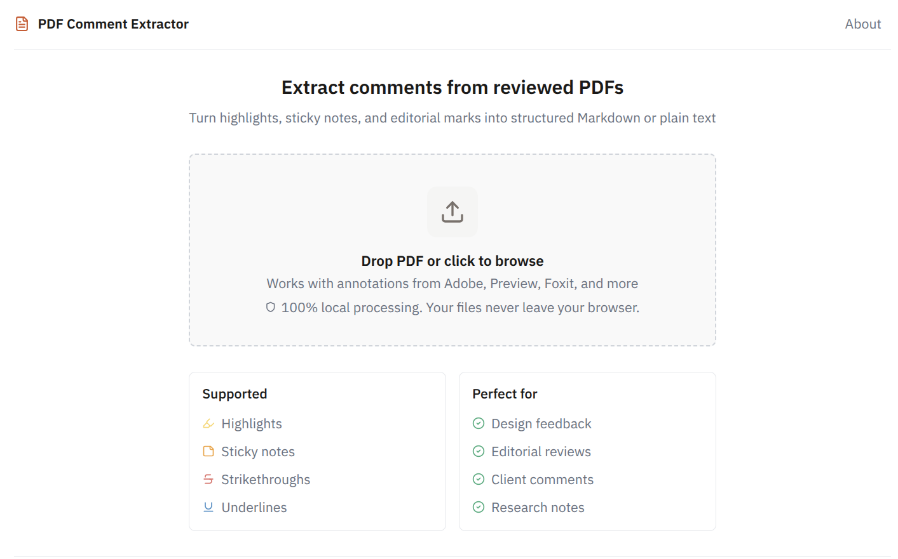

# PDF Comments

Extract annotations from PDFs and export to Markdown.

**[Try it live →](https://pdfcomments.app)**



## Features

- **Drag-and-drop** - Upload PDFs directly in the browser
- **100% private** - Files never leave your browser, no server processing
- **Annotation types** - Highlights, strikeouts, underlines, circles, squares, sticky notes, and free-text boxes
- **Smart grouping** - Links sticky notes to their associated markup
- **Export formats** - Detailed Markdown (AI-ready), GFM checklist, and rich HTML for Google Docs / Word

## Quick Start

```bash
pnpm install
pnpm dev
```

Open [localhost:3000](http://localhost:3000)

## Deploy

Static export to S3/CloudFront:

```bash
pnpm build           # outputs to /out
pnpm deploy:s3       # requires S3_BUCKET in .env
```

See [.env.example](.env.example) for configuration.

## Tech Stack

- Next.js 16 (static export, Turbopack)
- pdfjs-dist 5 (client-side PDF parsing)
- React 19
- TypeScript 6
- Tailwind CSS 4

## Contributing

- [docs/](docs/README.md) — architecture, extraction pipeline, design system, deploy runbook, and the add-a-new-annotation-type guide
- [CLAUDE.md](CLAUDE.md) — operator manual for Claude Code sessions (commands, gotchas, conventions)

## License

MIT - see [LICENSE](LICENSE)
